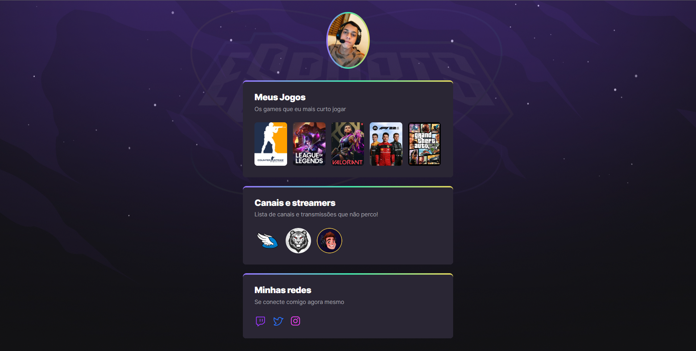

<h1>NLW eSports Trilha Explorer</h1>

## :memo: Descrição
* Projeto construído do evento Next Level Week da Rocketseat.

## :wrench: Tecnologias utilizadas
* HTML
* CSS
* GIT GitHub

## :rocket: Rodando o projeto
Project link : https://oducoelho.github.io/NLW-eSports-Trilha-Explorer/

## :handshake: Colaboradores
<table>
  <tr>
    <td align="center">
      <a href="http://github.com/oducoelho">
         
        
          <b>oducoelho</b>
        
      </a>
    </td>
  </tr>
</table>
